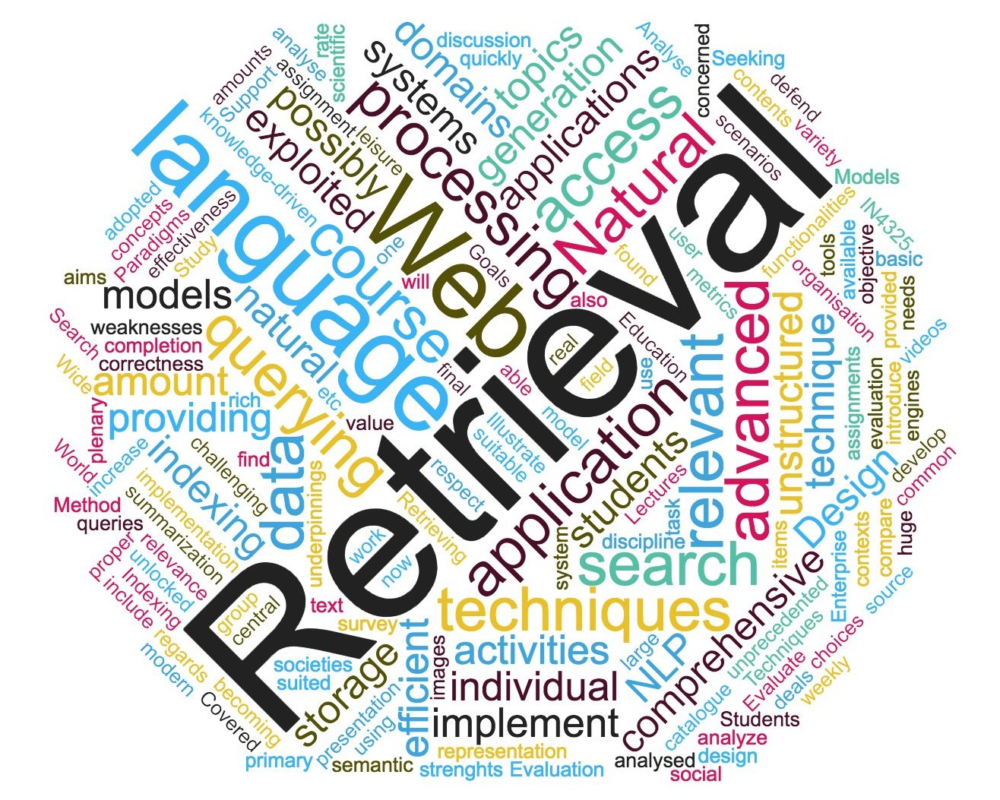
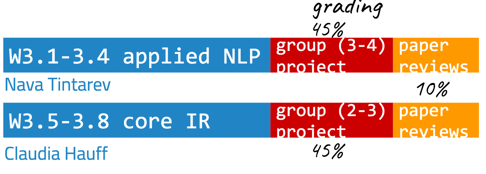
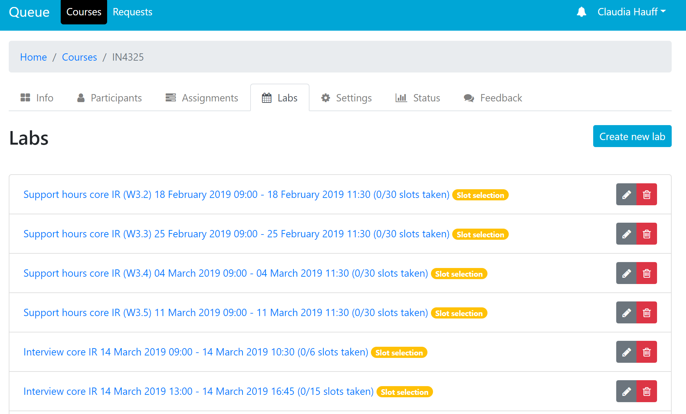

# IN4325 <!-- omit in toc -->
** NB: THIS PAGE IS IN THE PROCESS OF BEING UPDATED **

This repository contains the materials of the **MSc Information Retrieval** course running in 2019/2020 at TU Delft (Q3). The project setup is suitable for up to 100 students. 

## Table of contents <!-- omit in toc -->
- [Important links](#important-links)
- [Course description](#course-description)
- [Course team](#course-team)
- [ECs](#ecs)
- [Learning objectives](#learning-objectives)
- [:dart: Assessment](#dart-assessment)
  - [Group projects](#group-projects)
  - [Weekly reviews](#weekly-reviews)
- [Final grade](#final-grade)
- [:hourglass: Weekly support hours and interview](#hourglass-weekly-support-hours-and-interview)
  - [Applied NLP](#applied-nlp)
  - [Core IR](#core-ir)
- [:clock130: Course schedule](#clock130-course-schedule)
- [Deadlines](#deadlines)

## Important links

- [Applied NLP lectures](lecturesAppliedNLP.md)
- [Applied NLP project](projectAppliedNLP.md)
- [Core IR lectures](lecturesCoreIR.md)
- [Core IR project](projectCoreIR.md)
- [Paper review form](reviewForm.md)
- Signing up on Slack: [https://join.slack.com/t/in4325/signup](https://join.slack.com/t/in4325/signup)
- Signing up for support and the group interview: [https://queue.tudelft.nl/](https://queue.tudelft.nl/)

## Course description

Retrieving relevant information and making sense of it are two central activities in modern knowledge-driven societies. As the amount and variety of data increase at an unprecedented rate, access to relevant, usually unstructured information is becoming more and more challenging. The web is now the first stop for many (or most?) information seekers, and web search engines are our key to unlocking that vast and largely unstructured pile of information. 

**But how do search engines actually work?** This is what this course is about. In the **first module** of the course, we cover natural language processing (NLP) and natural language generation (NLG). 

In the **second module** of the course we focus on **core IR** techniques such as indexing, retrieval models, evaluation metrics and so on.  While for many years, IR and NLP researchers stayed far away from each other, in recent years the two fields have moved closer together, with search engines using NLP techniques to enhance the search experience, e.g. by providing automatically generated explanations of search result rankings and by enabling a _dialogue_ to take place between the search engine and user.

The split (applied NLP/core IR) will be made halfway through the course: the first eight lectures cover applied NLP techniques, the remaining eight lectures cover core IR techniques. 

## Course team

This distribution also fits the lecturer team of this course: [Assistant Prof. Nava Tintarev](http://navatintarev.com/) teaches the applied NLP lectures, while [Associate Prof. Claudia Hauff](https://chauff.github.io/) teaches the core IR lectures. The course team is completed by a number of PhDs and Postdocs (all from the [Web Information Systems group](http://www.wis.ewi.tudelft.nl/)) who support the course through guest lectures and project supervision and a TA who focuses on the grading of the paper reviews:

- Dr. Oana Inel (Postdoc)
- Dr. Mesut Kaya (Postdoc)
- Dr. David Maxwell (Postdoc)
- Priya Sarkar (TA)
- Arthur Câmara (PhD student)
- Peide Zhu (PhD student)
- Nirmal Roy (PhD student)

Claudia and Nava are the responsible instructors of this course and can jointly be reached at **in4325-ewi@tudelft.nl**.

The whole course team can also be found on a dedicated [Slack channel](https://join.slack.com/t/in4325/signup) - join it to get quick feedback on questions/issues. You have to use your `@student.tudelft.nl` email address to join!

## ECs

This is a **5 EC course**, with **140 hours** of course work in total. We expect you to spread the load evenly across the course weeks.

## Learning objectives

Applied NLP module:
- Describe common **natural language generation models**, and analyse their application in different domains.
- Design and develop **natural language processing** applications.
- **Evaluate** natural language processing applications in different task contexts.
- Illustrate suitable application scenarios for advanced natural language processing topics such as **natural language queries** and **summarization**.

Core IR module:
- Describe the different **information retrieval models**, and compare their strengths and weaknesses.
- Describe and implement different **indexing techniques**.
- Describe and analyze **querying techniques** with respect to their most suited application domains.
- Analyze the effectiveness of an information retrieval system through proper use of **evaluation metrics**.
- **Design and implement/improve a search system**, possibly using advanced social and semantic search functionalities. Support and defend the relevance and correctness the choices with regards to the adopted information retrieval model, indexing technique, and querying technique.

## :dart: Assessment

This course has no final exam, instead the grade is determined through three components: 

1. One group project applied NLP.
2. One group project core IR.
3. Individual review activities.

**All assessment items (reviews, projects reports) have to be submitted via Brightspace.**

### Group projects

The group projects follow each other. During the first 5 course weeks, the group tackles the [applied NLP project](projectAppliedNLP.md), and during the second 5 weeks of the course the group tackles the [core IR project](projectCoreIR.md).

Group sizes:
- Applied NLP (3-4).
- Core IR (2-3).

The differences in group sizes will be taken into account during grading. 

At the end of each project phase we will conduct a **short interview** (15 minutes per group) about the group project and **its connection to the course content**. Based on the project report and the interview, each member of the group receives a grade. We have two project phases (applied NLP and core IR), so each group will have one interview in week 5 and week 10 (*tentatively*).

### Weekly reviews

Each lecture week is accompanied by **one required reading**, which is usually a scientific paper. We thus hav eight papers to review in total. For every required reading you are asked to write a *review*. These review activities are individual work.

Each review is graded as either *excellent*, *sufficient* or *insufficient*. In order to pass the course, **6 of the 8 offered review opportunities** have to be passed with at least *sufficient*. Use the provided [review template](reviewForm.md) and follow its instructions. Reviews are submitted via Brightspace.

## Final grade

Each of the two project phases is worth 45% of the final grade, consisting of the following parts:
- Report writing, background & context:  10%
- Report technical correctness: 10%
- Report results & discussion: 10%
- Interview (understanding, insights): 15%

The paper review is worth 10% of the final grade. We take your review grades and convert them into points: 1 point per *sufficient* and 2 points per *excellent*. 16 points (i.e. 8x *excellent*) is a grade of 10, 8 points (i.e. 8x *sufficient*) is a grade of 6. Points between 9 and 18 are converted to grades in a linear fashion.

In order to pass this course, you need to fullfil **all** of the following:
1. Receive an overall grade of 5.8 or higher (in alignment with TU Delft's exam regulations). 
2. Complete both project phases with at least a grade of 5.
3. Receive a *sufficient* for at least 6 of the 8 reviews.

## :hourglass: Weekly support hours and interview

We do not have fixed lab hours. Due to the heavy emphasis on project work in this course, we offer weekly support hours: 

### Applied NLP
During weeks 3.2 to 3.5 between 9am and 11:30am at least two staff members will be available to help groups with their NLP projects. You can sign up for 15 minute timeslots on TU Delft's queue system: https://queue.tudelft.nl/
Look for `IN4325`, and you should see something along those lines:

The support hours are offered in building 28, please come to the waiting area near room W04.900 (Nava Tintarev's office).
**Applied NLP interviews** on March 12 and March 13 are also scheduled this way. *Once again: one timeslot per group!*

### Core IR 

During weeks 3.5 to 3.9 on Fridays between 9am and 11:30am at least two staff members will be available to help groups with their IR project. You can sign up for 15 minute timeslots on TU Delft's queue system: https://queue.tudelft.nl/.

Click on the day you want to get support and then *enroll* for a particular timeslot. Per group, please pick only one timeslot per week. The support hours are offered in building 28, please come to the waiting area near room E04.100 (Claudia Hauff's office). 

**Core IR interviews** on **April 20** and **April 21** are also scheduled this way. *Once again: one timeslot per group!* The core IR interviews are postponed to the start of week "3.11" due to conference attendance by C. Hauff in week 3.10. **If your group has to have the interview in week 3.10, please email c.hauff@tudelft.nl to work out a remote-interview solution.**

## :clock130: Course schedule
Thursdays: 10:45-12:45; Fridays: 13:45-15:45
The lecture locations have been taken from [TUD's timetable site](https://mytimetable.tudelft.nl/) on January 16th, 2020.
**Check your timetable for updates on time and location! Note that many lectures are in the center of Delft, at the cinema.** :bike: :cinema:

| Week | Thursday lecture                  | Friday lecture                    | Group project          | No. of reviews |
|------|-----------------------------------|-----------------------------------|------------------------|--------------|
| 3.1  | NLP introduction (`Pathe Zal 6`, N. Tintarev)    | Text analysis (`BK-CZ B`, N. Tintarev)                 | NLP Project group settled| 1            |
| 3.2  | Semantics (`Pathe Zal 6`, N. Tintarev) | Evaluation NLP (`BK-CZ B`, N. Tintarev)       |      NLP project settled                  | 1            |
| 3.3  | ML for NLP (`Pathe Zal 6`, N. Tintarev)  | Language generation (`BK-CZ B`, N. Tintarev) |                        | 1            |
| 3.4  | NLP annotations (`Pathe Zal 6`, O. Inel)           | Word embeddings (`BK-CZ B`, N. Tintarev)     |   Intermediate applied NLP report due                     | 1           |
| 3.5  | IR evaluation (`Pathe Zal 6`, C. Hauff)          | Retrieval models (`BK-CZ B`, C. Hauff)       |  Final NLP report due / interviews. Project group settled IR.                   | 1            |
| 3.6  | IR indexing (`Pathe Zal 6`, C. Hauff)            | Query refinement (`BK-CZ B`, C. Hauff)      |   Core IR project settled                     | 1           |
| 3.7  | Personalization (`Pathe Zal 6`, C. Hauff)         | Interactive IR (`BK-CZ B`, D. Maxwell)        |                        | 1            |
| 3.8  | Learning to rank (`Pathe Zal 6`, C. Hauff)       | Neural IR (`BK-CZ B`, A. Camara)             |            | 1           |
| 3.9  |       |            |             Intermediate core IR report due           |            |
| 3.**10**  |                                   |                                   |               Core IR report due         |              |
| 3.**11** |                                   |                                   |      Core IR interviews          | |

We start off in weeks 3.1 to 3.4 with the [applied NLP module](lecturesAppliedNLP.md), alongside which the [applied NLP group project](projectAppliedNLP.md) runs. In week 3.5 we switch to the [core IR module](lecturesCoreIR.md), alongside which the [core IR group project](projectCoreIR.md) runs.

## Deadlines

This course has a number of smaller (the paper reviews :small_blue_diamond:) and larger (anything to do with the group projects :small_orange_diamond:) deadlines. They are listed here in order of **due date**. The deadlines are always at 23:59 CET (i.e. local time) of the respective deadline day. We rely on Brigthspace for submission. Brightspace submissions close automatically, be sure to not be late.

Reminder of the rules:
- The project proposal and intermediate report submissions are required, but are **not** graded. The proposal has to be signed off by an instructor (does it fit the project goals? is the scope sufficient?). The intermediate proposal can be a last chance for feedback. Submit whatever you have at that point.

**Applied NLP lecture weeks (the final deadline is in week 3.5):**

:small_blue_diamond: Review P1: handed out February 14, **due February 21**.

:small_orange_diamond: applied NLP project proposal: **due February 21**.

:small_blue_diamond: Review P2: handed out February 21, **due February 28**.

:small_blue_diamond: Review P3: handed out February 28, **due March 6**.

:small_orange_diamond: NLP intermediate project report: **due March 4**.

:small_blue_diamond: Review P4: handed out March 6, **due March 13**.

:small_orange_diamond: NLP final project report: **due March 11**.

:small_orange_diamond: NLP project interviews: **March 12** and **March 13**.

**Core IR lecture weeks (the final report deadline is in week 3.10):**

:small_blue_diamond: Review P5: **due March 20**.

:small_orange_diamond: core IR project proposal: **due March 20**.

:small_blue_diamond: Review P6: **due March 27**.

:small_blue_diamond: Review P7: **due April 3**.

:small_orange_diamond: core IR intermediate project report: **due April 10**.

:small_blue_diamond: Review P8: **due April 10**.

:small_orange_diamond: core IR final project report: **due April 17**.

:small_orange_diamond: core IR project interviews: **April 20** and **April 21**. 

